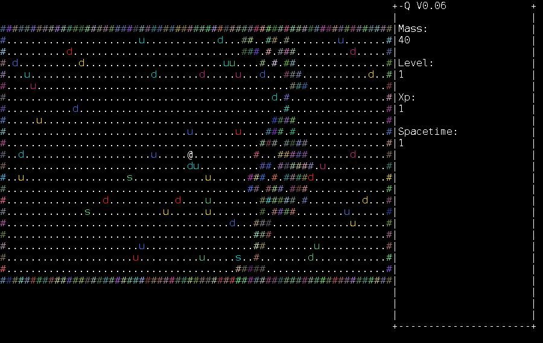

# Quarker

Quarker is a turn-based ASCII roguelike where you play as a particle in unstable spacetime, absorb quarks to grow, and survive as long as your mass holds.



## Why It Feels Different

- Particle-physics flavor is mechanical, not cosmetic.
- Mass replaces traditional HP framing.
- Spacetime wormholes replace classic dungeon stairs.
- Growth comes from absorbing quarks you defeat.
- Colored quark variants create a distinct enemy identity.

## Quick Start

Requirements:
- Java 25+
- make

Run locally:

```bash
make run
```

Build release artifacts:

```bash
make package
```

## Controls

Movement:
- Arrow keys, or `h j k l` for cardinal movement
- `y u b n` for diagonals
- `.` wait one turn

Actions:
- `>` go down a wormhole
- `<` go up a wormhole
- `l` look mode
- `Enter` in look mode inspects tile contents
- `p` save screenshot and print saved path
- `P` save screenshot silently (no message)
- `V` start/stop turn recording; stopping exports an animated GIF
- `Esc` exit

Notes:
- Screenshots and recordings are saved to `screenshots/` in the working directory.
- Save/load are currently disabled.

## Releases

- Latest release: https://github.com/SquidPony/quarker/releases/latest
- All releases: https://github.com/SquidPony/quarker/releases
